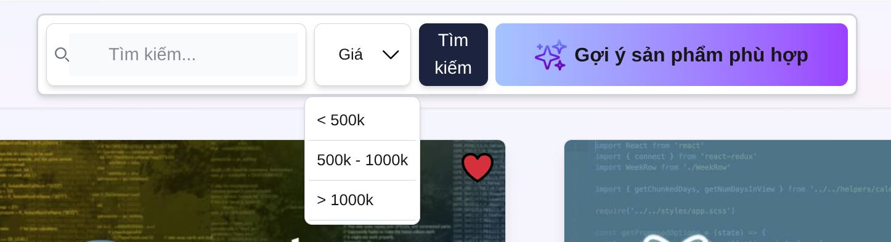
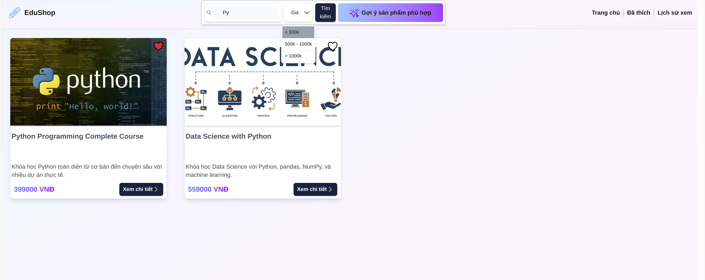
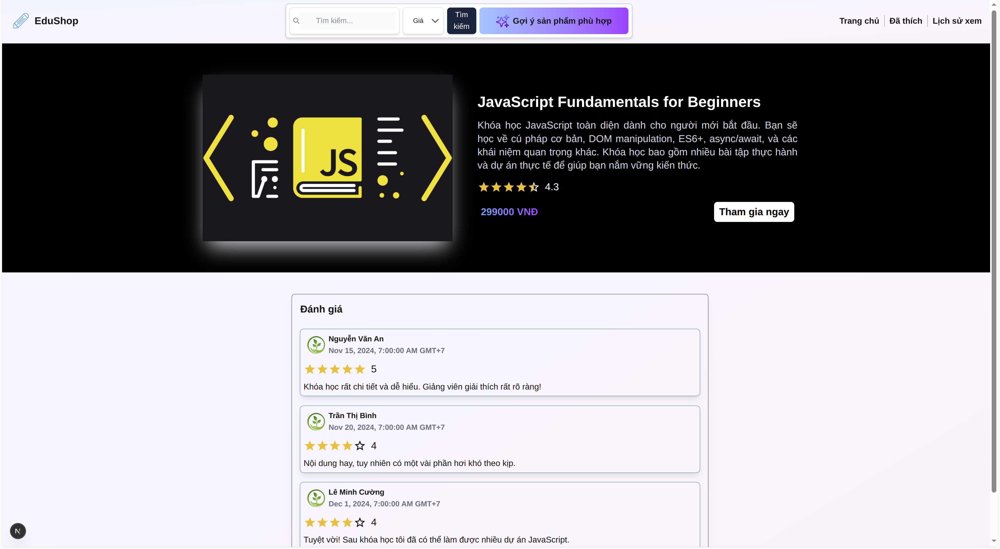
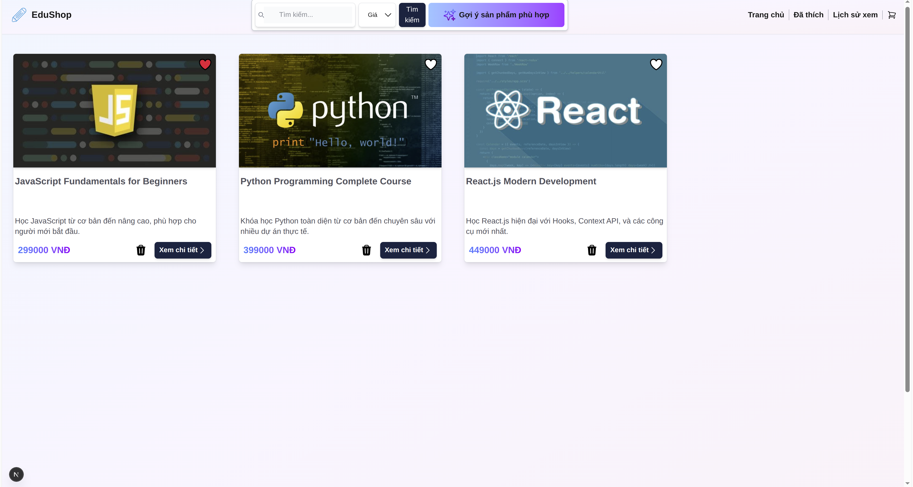

# Giới thiệu các chức năng

👉 **1: Hiển thị danh sách sản phẩm**

👉 **2: Tìm kiếm theo tên và lọc theo giá tiền**

👉 **3: Gợi ý AI dựa theo danh sách yêu thích, lịch sử xem và giỏ hàng**

👉 **4: Modal chi tiết sản phẩm**

👉 **5: Yêu thích sản phẩm và hiển thị danh sách yêu thích**

👉 **6: LỊch sử xem**

👉 **7: Xử lý lỗi khi API fail**


# Cách build và run hệ thống

👉 **Step 1: Clone code từ github link**
```bash
git clone https://github.com/HuynhDat2002/edu-shop.git
```

👉 **Step 2: Cài đặt npm packages**
```bash
npm install
```

👉 **Step 3: Chạy hệ thống trong môi trường dev**
```bash
npm run dev
```

👉 **Step 4: Truy cập bằng trình duyệt**
```bash
http://localhost:3000
```
👉 **Cách build**
```bash
npm run build
```

# Truy cập thông qua vercel
```bash
https://edu-shop.vercel.app/
```


# Giao diện
    Homepage Screenshot


    Search and Filter and Suggestion by AI Screenshot


    Search and Filter Result Screenshot



    Course Details Screenshot


    Liked Courses Screenshot


    History Screenshot


    Cart Screenshot

